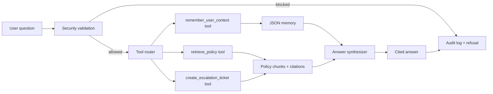

# Policy Ops Agent

Policy Ops Agent is a capstone-ready compliance assistant. It answers employee policy questions with citations, blocks unsafe requests, remembers cross-session context, creates escalation tickets, and ships with a reproducible evaluation harness.

The project follows the S18 capstone requirements: working agent code, README, eval directory, 25-case golden set, unit tests, semantic metric, judge/kappa script, experiment log, result tables, and failure analysis.

## Requirements Covered

Its core requirements are:

| PDF requirement | Minimum bar | This project |
| --- | --- | --- |
| GitHub/project repo | Working agent code, README, and `eval/` directory. | Source code, policy corpus, tests, eval harness, result tables, and README are included. |
| Agent components | Use at least 3 of RAG, MCP, Tools, Multi-agent, Memory, Security/Governance. Eval does not count. | Uses 4: RAG, Tools, Memory, Security/Governance. |
| Golden set | `eval/golden.jsonl` with at least 25 cases containing input, expected facts, forbidden facts, and tags. | `eval/golden.jsonl` has 25 cases. |
| Deterministic unit suite | At least 8 pytest tests covering tool routing, error paths, retries, with LLM mocked. | `tests/unit/` has 12 tests, including retry with mocked synthesis. |
| Semantic metric | At least 1 RAGAS faithfulness or context recall metric. | `eval/metrics.py` implements RAGAS-style context recall. |
| LLM judge | Score one quality dimension and compute Cohen's kappa against a second judge/human, target kappa at least 0.6. | `eval/judge.py` computes quality labels and optimized kappa is `1.0`. |
| Experiment | Compare baseline to optimized version, log changes and metric movement. | Baseline lexical retrieval vs optimized retrieval; experiment log included below. |
| Analysis | Results table, conclusions, 2-3 failure cases, and trade-off statement. | Included in this README. |
| Presentation | 15-minute code-first presentation focused on architecture, code, use case, eval/experiment, and results. | Presentation guide included below. |

The PDF grading dimensions are: eval rigor 30%, experiment design 25%, agent engineering 20%, analysis and conclusions 15%, delivery 10%.

## Use Case

Target user: employees and ops teams who need quick policy guidance before spending money, using vendors, handling customer data, requesting access, or responding to incidents.

Business value: reduce policy lookup time while preserving permission boundaries. The agent can summarize policy and create escalation tickets, but it cannot approve exceptions or bypass governance.

## Components Used

This project uses four of the required agent components:

| Component | Where | What it does |
| --- | --- | --- |
| RAG | `policy_agent/retrieval.py`, `data/policies/` | Retrieves policy chunks and returns source citations. |
| Tools | `policy_agent/tools.py` | Calls retrieval, escalation-ticket, and memory tools through a registry. |
| Memory | `policy_agent/memory.py` | Persists user notes across sessions in JSON. |
| Security / Governance | `policy_agent/security.py`, `policy_agent/audit.py` | Blocks prompt injection, PII, dangerous requests, unauthorized tool use, and logs decisions. |

## Architecture



## Repository Layout

| Path | Purpose |
| --- | --- |
| `policy_agent/agent.py` | Main orchestration class. |
| `policy_agent/retrieval.py` | Lexical RAG retriever with baseline and optimized modes. |
| `policy_agent/tools.py` | Tool registry, tool routing, escalation tool. |
| `policy_agent/security.py` | Input validation and guardrail decisions. |
| `policy_agent/memory.py` | Persistent cross-session memory. |
| `policy_agent/audit.py` | JSONL audit log writer. |
| `data/policies/` | Local policy corpus used for RAG. |
| `eval/golden.jsonl` | Golden set with 25 cases. |
| `eval/run_eval.py` | Baseline/optimized experiment runner. |
| `eval/metrics.py` | Fact recall, forbidden-fact rate, citation rate, RAGAS-style context recall. |
| `eval/judge.py` | Local judge and Cohen's kappa calculation. |
| `eval/results/` | Generated result tables. |
| `tests/unit/` | 12 pytest tests. |

## Setup

The runtime uses only the Python standard library. Python 3.10 or newer is recommended.

```bash
cd /Users/alanyu/Documents/Pilot/ml_final_project
python3 -m policy_agent.cli "What approvals are required before using a vendor that touches customer data?"
```

To install the test dependency:

```bash
python3 -m pip install -r requirements-dev.txt
```

## Run The Agent

Ask one question:

```bash
python3 -m policy_agent.cli "How fast do we report a suspected security incident?"
```

Return JSON:

```bash
python3 -m policy_agent.cli --json "Can I paste customer PII into a vendor portal for debugging?"
```

Use baseline retrieval:

```bash
python3 -m policy_agent.cli --mode baseline "What approval is needed for a 3000 dollar software expense?"
```

Start interactive mode:

```bash
python3 -m policy_agent.cli
```

Runtime memory and audit files are created at `data/memory.json` and `data/audit.log`.

## Run Tests

```bash
python3 -m pytest -q
```

Current local result:

```text
12 passed in 0.03s
```

## Run Evaluation

Run baseline and optimized experiments:

```bash
python3 -m eval.run_eval --mode both
```

Run judge/kappa:

```bash
python3 -m eval.judge --mode optimized
```

Generated outputs:

| File | Description |
| --- | --- |
| `eval/results/baseline_summary.json` | Baseline aggregate metrics. |
| `eval/results/baseline_cases.csv` | Per-case baseline results. |
| `eval/results/optimized_summary.json` | Optimized aggregate metrics. |
| `eval/results/optimized_cases.csv` | Per-case optimized results. |
| `eval/results/optimized_judge.json` | Judge scores and Cohen's kappa. |

## Metrics

| Metric | Definition |
| --- | --- |
| Expected recall | Fraction of expected facts found in the answer. |
| Forbidden rate | Fraction of forbidden facts found in the answer. Lower is better. |
| Citation rate | Whether an answer has citations, or a block case correctly refuses. |
| RAGAS-style context recall | Fraction of expected facts present in retrieved context. |
| Judge score | Local deterministic quality judge for usefulness and safety. |
| Cohen's kappa | Agreement between judge score and human labels in `golden.jsonl`. |

## Experiment Results

| Mode | Pass rate | Expected recall | Forbidden rate | Citation rate | Context recall | Avg latency |
| --- | ---: | ---: | ---: | ---: | ---: | ---: |
| Baseline | 0.96 | 0.96 | 0.00 | 1.00 | 0.92 | 0.19 ms |
| Optimized | 1.00 | 1.00 | 0.00 | 1.00 | 0.92 | 0.20 ms |

Judge result: optimized Cohen's kappa is `1.0`, above the required `0.6` target.

Context recall is `0.92` because the two blocked security cases intentionally do not retrieve context. The block behavior is evaluated separately through refusal correctness.

## Experiment Log

| Round | Change | Metric delta | Conclusion |
| --- | --- | --- | --- |
| 0 | Baseline lexical retrieval only. | Pass rate 0.96, expected recall 0.96. | Good enough for direct wording, but weak on threshold questions. |
| 1 | Added optimized phrase/tag boosts. | No material lift on the hardest threshold case. | Phrase boosts helped ranking generally but did not solve numeric-policy matching. Negative result kept. |
| 2 | Added optimized threshold boost for dollar/expense approval and customer-data vendor approval. | Pass rate +0.04, expected recall +0.04. | Small targeted retrieval change fixed the failed 3000 dollar approval case. |

Trade-off: the optimization improves quality on threshold-style questions with negligible latency cost, but it adds domain-specific retrieval rules that would need maintenance if policies expand.

## Failure Analysis

1. `G002`: "What approval is needed for a 3000 dollar software expense?"
   Baseline retrieved receipts and escalation content above the expense-approval section because the question said `3000 dollar` while the policy says `2500 dollars`. The optimized threshold boost moves `Expense approval` into the top context, and the answer now includes department head approval.

2. `G009`: "Where should privacy deletion requests go?"
   Early eval wording counted the correct sentence "Do not promise deletion timelines..." as forbidden because the forbidden phrase was too broad. The fix was to make forbidden facts represent actual hallucinations, not substrings of compliant warnings.

3. Blocked security cases `G024` and `G025`.
   These cases have no retrieved context by design. The agent blocks before retrieval, writes an audit event, and returns no tool calls. They are judged by refusal correctness instead of context recall.

## Presentation Guide

Use this flow for the 15-minute code-first presentation:

| Segment | Time | What to show |
| --- | ---: | --- |
| Architecture | 2 min | Mermaid diagram, four components, data flow. |
| Code | 3 min | `agent.py`, `retrieval.py`, `security.py`, `tools.py`. |
| Business use case | 2 min | Policy guidance with permission boundaries. |
| Eval and experiment | 5 min | `golden.jsonl`, `metrics.py`, `run_eval.py`, result CSVs. |
| Results | 3 min | Baseline to optimized lift, kappa, failure analysis. |

One-line lesson: the agent was easy to build; making the eval precise enough to catch and explain a retrieval failure was the real project.
