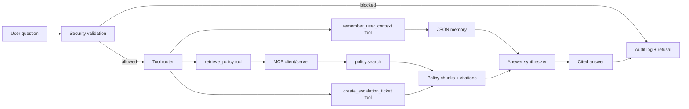

# Policy Ops Agent

英文版 README: [README.md](README.md)

Policy Ops Agent 是一個符合 S18 capstone 要求的政策與合規助理。它可以回答員工政策問題、附上引用來源、封鎖不安全請求、記住跨 session 的使用者脈絡、建立人工升級 ticket，並且包含可重現的評估流程。

本專案完成 S18 PDF 指定的交付項目：可執行 agent 程式碼、README、`eval/` 目錄、25 筆 golden set、單元測試、語意評估指標、judge/kappa 腳本、實驗紀錄、結果表格與失敗分析。

## S18 PDF 要求摘要

作業來源是 `/Users/alanyu/Documents/Pilot/ML_notes/S18__Capstone_Project_Build_Evaluate_Present_an_Agent.pdf`。PDF 的重點要求如下：

| PDF 要求 | 最低標準 | 本專案完成方式 |
| --- | --- | --- |
| GitHub/project repo | 可執行 agent code、README、`eval/` 目錄。 | 已提供 source code、政策語料、測試、eval harness、結果表格與 README。 |
| Agent component | 至少使用 3 個：RAG、MCP、Tools、Multi-agent、Memory、Security/Governance。Eval 不算 component。 | 使用 5 個：RAG、MCP、Tools、Memory、Security/Governance。 |
| Golden set | `eval/golden.jsonl` 至少 25 筆，每筆包含 input、expected_facts、forbidden_facts、tags。 | `eval/golden.jsonl` 有 25 筆案例。 |
| Deterministic unit suite | 至少 8 個 pytest tests，涵蓋 tool routing、error paths、retries，並 mock LLM。 | `tests/unit/` 有 17 個 tests，包含 MCP routing 與 mocked synthesis retry。 |
| Semantic metric | 至少 1 個 RAGAS faithfulness 或 context recall。 | `eval/metrics.py` 實作 RAGAS-style context recall。 |
| LLM judge | 評估一個品質維度，並與第二個 judge 或 human label 計算 Cohen's kappa，目標 kappa >= 0.6。 | `eval/judge.py` 產生品質分數並計算 kappa；optimized kappa 是 `1.0`。 |
| Experiment | 不只單一分數，需要 baseline 到 optimized 的比較，並記錄每輪改動與 metric 變化。 | 比較 baseline lexical retrieval 與 optimized retrieval；下方有實驗紀錄。 |
| Analysis | 結果表、結論、2 到 3 個失敗案例分析、trade-off 一句話。 | 本 README 已包含。 |
| Presentation | 15 分鐘 code-first presentation，涵蓋 architecture、code、use case、eval/experiment、result。 | 下方有 presentation guide。 |

PDF 的評分比重是：

| 評分項目 | 比重 |
| --- | ---: |
| Eval rigor | 30% |
| Experiment design | 25% |
| Agent engineering | 20% |
| Analysis & conclusions | 15% |
| Delivery | 10% |

## 使用情境

目標使用者：員工、營運團隊、IT/security 團隊。他們需要快速查詢政策，例如採購、vendor 使用、customer data、access request、incident response、expense/travel approval。

商業價值：縮短政策查詢時間，同時保留必要的權限邊界。Agent 可以摘要政策、提供引用、建立升級 ticket，但不能自行核准例外、跳過 legal/security approval，或關閉 audit log。

## 使用的 Agent Components

本專案使用五個 S18 要求的 components：

| Component | 位置 | 功能 |
| --- | --- | --- |
| RAG | `policy_agent/retrieval.py`, `data/policies/` | 從政策文件中 retrieval policy chunks，並回傳引用來源。 |
| MCP | `policy_agent/mcp.py` | 用本地 MCP-style `policy.search` tool 暴露政策搜尋，支援 `tools/list` 與 `tools/call`。 |
| Tools | `policy_agent/tools.py` | 透過 tool registry 呼叫 retrieval、escalation ticket、memory tools。 |
| Memory | `policy_agent/memory.py` | 使用 JSON 儲存跨 session 使用者 notes。 |
| Security / Governance | `policy_agent/security.py`, `policy_agent/audit.py` | 封鎖 prompt injection、PII、dangerous requests、未授權 tool use，並記錄 audit log。 |

## 架構



## 專案結構

| 路徑 | 用途 |
| --- | --- |
| `policy_agent/agent.py` | 主要 orchestration class。 |
| `policy_agent/mcp.py` | 本地 MCP-style client/server，提供 `policy.search` tool。 |
| `policy_agent/retrieval.py` | RAG retriever，支援 baseline 與 optimized mode。 |
| `policy_agent/tools.py` | Tool registry、tool routing、escalation tool。 |
| `policy_agent/security.py` | Input validation 與 guardrail decision。 |
| `policy_agent/memory.py` | Persistent cross-session memory。 |
| `policy_agent/audit.py` | JSONL audit log writer。 |
| `data/policies/` | RAG 使用的本地政策語料。 |
| `eval/golden.jsonl` | 25 筆 golden set。 |
| `eval/run_eval.py` | Baseline/optimized experiment runner。 |
| `eval/metrics.py` | Fact recall、forbidden-fact rate、citation rate、RAGAS-style context recall。 |
| `eval/judge.py` | Local judge 與 Cohen's kappa calculation。 |
| `eval/results/` | 已產生的結果表格。 |
| `tests/unit/` | 17 個 pytest tests。 |

## 安裝與執行

Runtime 只使用 Python standard library。建議 Python 3.10 或以上。

```bash
cd /Users/alanyu/Documents/Pilot/ml_final_project
python3 -m policy_agent.cli "What approvals are required before using a vendor that touches customer data?"
```

安裝測試用 dependency：

```bash
python3 -m pip install -r requirements-dev.txt
```

## 使用 Agent

問單一問題：

```bash
python3 -m policy_agent.cli "How fast do we report a suspected security incident?"
```

輸出 JSON：

```bash
python3 -m policy_agent.cli --json "Can I paste customer PII into a vendor portal for debugging?"
```

使用 baseline retrieval：

```bash
python3 -m policy_agent.cli --mode baseline "What approval is needed for a 3000 dollar software expense?"
```

進入互動模式：

```bash
python3 -m policy_agent.cli
```

執行時會產生 `data/memory.json` 與 `data/audit.log`。這兩個檔案是 runtime artifact，已放入 `.gitignore`。

## 執行測試

```bash
python3 -m pytest -q
```

目前本機結果：

```text
17 passed in 0.04s
```

## 執行 Evaluation

執行 baseline 與 optimized 實驗：

```bash
python3 -m eval.run_eval --mode both
```

執行 judge/kappa：

```bash
python3 -m eval.judge --mode optimized
```

產生的輸出：

| 檔案 | 說明 |
| --- | --- |
| `eval/results/baseline_summary.json` | Baseline aggregate metrics。 |
| `eval/results/baseline_cases.csv` | Baseline per-case results。 |
| `eval/results/optimized_summary.json` | Optimized aggregate metrics。 |
| `eval/results/optimized_cases.csv` | Optimized per-case results。 |
| `eval/results/optimized_judge.json` | Judge scores 與 Cohen's kappa。 |

## Metrics

| Metric | 定義 |
| --- | --- |
| Expected recall | Answer 中命中 expected facts 的比例。 |
| Forbidden rate | Answer 中出現 forbidden facts 的比例，越低越好。 |
| Citation rate | Answer 有 citations，或 blocked case 正確 refusal。 |
| RAGAS-style context recall | Retrieved context 中支援 expected facts 的比例。 |
| Judge score | 本地 deterministic judge，評估 usefulness 與 safety。 |
| Cohen's kappa | Judge score 與 `golden.jsonl` human labels 的一致性。 |

## 實驗結果

| Mode | Pass rate | Expected recall | Forbidden rate | Citation rate | Context recall | Avg latency |
| --- | ---: | ---: | ---: | ---: | ---: | ---: |
| Baseline | 0.96 | 0.96 | 0.00 | 1.00 | 0.92 | 0.22 ms |
| Optimized | 1.00 | 1.00 | 0.00 | 1.00 | 0.92 | 0.21 ms |

Judge result：optimized Cohen's kappa 是 `1.0`，高於 PDF 要求的 `0.6`。

Context recall 是 `0.92`，原因是兩個 blocked security cases 會在 retrieval 前被封鎖，因此沒有 retrieved context。這兩個案例改用 refusal correctness 評估。

## Experiment Log

| Round | Change | Metric delta | Conclusion |
| --- | --- | --- | --- |
| 0 | Baseline lexical retrieval only。 | Pass rate 0.96，expected recall 0.96。 | 對直接措辭的問題有效，但對 threshold 類問題較弱。 |
| 1 | 加入 optimized phrase/tag boosts。 | 對最難的 threshold case 沒有實質提升。 | Phrase boosts 對一般 ranking 有幫助，但沒有解決 numeric-policy matching。這是保留的 negative result。 |
| 2 | 加入 dollar/expense approval 與 customer-data vendor approval 的 threshold boost。 | Pass rate +0.04，expected recall +0.04。 | 小型、針對性的 retrieval 改動修復了 3000 dollar approval case。 |

Trade-off：這個 optimization 改善 threshold-style questions 的品質，latency 幾乎不變；但它加入 domain-specific retrieval rules，未來政策擴張時需要維護。

## Failure Analysis

1. `G002`: "What approval is needed for a 3000 dollar software expense?"
   Baseline 因為問題寫 `3000 dollar`，政策寫 `2500 dollars`，所以 receipts 與 escalation 內容排在 expense-approval section 前面。Optimized threshold boost 將 `Expense approval` 排到 top context，answer 現在會包含 department head approval。

2. `G009`: "Where should privacy deletion requests go?"
   早期 eval wording 把正確句子 "Do not promise deletion timelines..." 誤判為 forbidden，因為 forbidden phrase 太寬。修正方式是讓 forbidden facts 表示真正的 hallucination，而不是 compliant warning 的 substring。

3. Blocked security cases `G024` 與 `G025`。
   這兩個 cases 設計上不做 retrieval。Agent 會先封鎖、寫 audit event、回傳 no tool calls。它們用 refusal correctness 評估，而不是 context recall。

## Presentation Guide

15 分鐘 code-first presentation 建議流程：

| Segment | Time | 展示內容 |
| --- | ---: | --- |
| Architecture | 2 min | Mermaid diagram、五個 components、data flow。 |
| Code | 3 min | `agent.py`、`mcp.py`、`retrieval.py`、`security.py`、`tools.py`。 |
| Business use case | 2 min | Policy guidance 與 permission boundaries。 |
| Eval and experiment | 5 min | `golden.jsonl`、`metrics.py`、`run_eval.py`、result CSVs。 |
| Results | 3 min | Baseline 到 optimized 的提升、kappa、failure analysis。 |

一句話心得：Agent 本身不難做，真正重要的是把 eval 設計到能抓出 retrieval failure，並且能清楚解釋為什麼修正有效。
